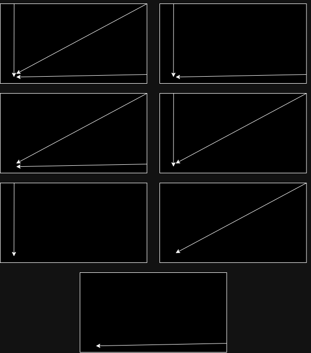

# Actividad Modelado - 3 Balas

## Modelo de Red Neuronal

Para abordar este problema, se propone el uso de una red neuronal multicapa (MLP).

- La cantidad de neuronas en la capa de entrada corresponde a la cantidad de características de los datos de entrada, que en este caso son cinco en total referentes a las tres balas.
- La cantidad de neuronas en la capa de salida coincide con la cantidad de acciones de salida, que son tres: saltar, moverse hacia la izquierda y moverse hacia la derecha.

### Funcion de Activacion

En este caso, se usa la función de activación "sigmoide".

### Bias
El bias puede tomar valores reales, como pueden ser positivos, negativos o cero.

Como no hay un límite específico para el valor máximo que puede tomar el bias. Los valores del bias suelen ser pequeños y se inicializan aleatoriamente para facilitar el entrenamiento de la red neuronal.

En este caso, el bias se incluiría en cada neurona de las capas ocultas y de salida, excepto en la capa de entrada. 

De esta forma, el bias ayudaría a ajustar la salida de cada neurona en función de los datos de entrada y los pesos, lo que permitiría que la red neuronal aprenda a esquivar las balas de manera efectiva.

### Peso Sinaptico 

Los pesos sinápticos son parámetros ajustables que se utilizan para ponderar la influencia de las entradas en las neuronas de la red.

Estos pesos se ajustan (por incremento) durante el entrenamiento de la red neuronal para minimizar el error entre las salidas del modelo y el target (objetivo) esperado.

En un perceptron simple, los pesos sinápticos se conocen como W1 y W2. 

En los pesos sinápticos es donde se almacena el conocimiento de la red neuronal y, si se quiere usar el modelo para futuros problemas similares, se debe guardar el bias, W1 y W2. 

## Tabla - Entradas y Salidas

**Tabla:**

| Dx1 (Distancia Bala 1) | Vx1 (Velocidad Bala 1) | Dx2 (Distancia Bala 2) | Vx2 (Velocidad Bala 2) | Dy (Distancia Bala 3) | S1 (Saltar) | S2 (Moverse Derecha) | S3 (Moverse Izquierda)
|:---------------:|:---------------:|:---------------:|:---------------:|:--------------:|:-----------:|:-----------:|:------------:|
|    500    | 100 |      500    |       100      |       450        |      0      |      0      |   0   |
|    30    | 100 |      500    |       100      |       450        |      1      |      0      |    0   |
|    500    | 100 |      500    |       100      |       30        |      0      |      1      |    0   |
|    30    | 100 |      500    |       100      |       30        |      1      |      1      |    0   |
|    20    | 100 |      20    |       100      |       20        |      1      |      0      |    1   |

Entradas:
- Distancia de la bala 1
- Velocidad de la bala 1
- Distancia de la bala 2
- Velocidad de la bala 2
- Distancia de la bala 3
  
Salidas:
- Saltar
- Moverse Izquierda
- Moverse Derecha  

## Target

El target representa la salida deseada o esperada para un conjunto de entradas. Es la respuesta correcta que se quiere que la red neuronal aprenda a predecir. Por lo que su función es usarse como referencia u objetivo durante el proceso de entrenamiento de una red neuronal.

Durante el entrenamiento de la red neuronal, se compara la salida producida contra el target esperado, y se calcula el error. El valor del error se usa para ajustar los pesos sinápticos, con el objetivo de minimizar el error para que cada vez se parezca al resultado esperado.

El target, en este caso, es la combinación de acciones que el jugador debe tomar para esquivar/evitar las tres balas que se dirigen hacia el jugador.
- La primera bala se dirige enfrente del jugador en una línea horizontal con velocidad variable.
- La segunda bala se dirige diagonalmente con velocidad variable.
- La tercera bala cae encima del jugador en el mismo punto con la misma velocidad constante.

### Posibles Situaciones

- Primera situación:
Las tres balas llegan a estar cerca del jugador, en ese caso lo recomendado es mover al jugador a la izquierda (para atrás), y de esa forma esquiva la segunda (diagonal) y tercera bala (cae), y solo tendría que saltar para esquivar la primera bala (horizontal).

- Segunda situación:
La primera bala (horizontal) y la tercera bala (cae) están cerca del jugador, se recomienda mover al jugador para atrás o adelante y saltar.

- Tercera situación:
La primera bala (horizontal) y la segunda bala (diagonal) están cerca del jugador, se recomienda mover al jugador para atrás y saltar.

- Cuarta situación:
La segunda bala (diagonal) y la tercera bala (cae) están cerca del jugador, se recomienda mover al jugador para atrás.

- Quinta situación:
La tercera bala (cae) está cerca del jugador, se recomienda mover al jugador para atrás o adelante.

- Sexta situación:
La segunda bala (diagonal) está cerca del jugador, se recomienda mover al jugador para atrás o adelante.

- Séptima situación:
La primera bala (horizontal) está cerca del jugador, se recomienda saltar.

A continuación se muestra un diagrama que representa las situaciones, ordenadas de la primera a la séptima, de arriba hacia abajo y de izquierda a derecha.

## Representacion Modelo MLP

Basándonos en lo anterior, se muestra a continuación un diagrama que representa la arquitectura de la red neuronal.

## Comportamiento de Datos

## Grafica

### Codigo 
### Resultados

