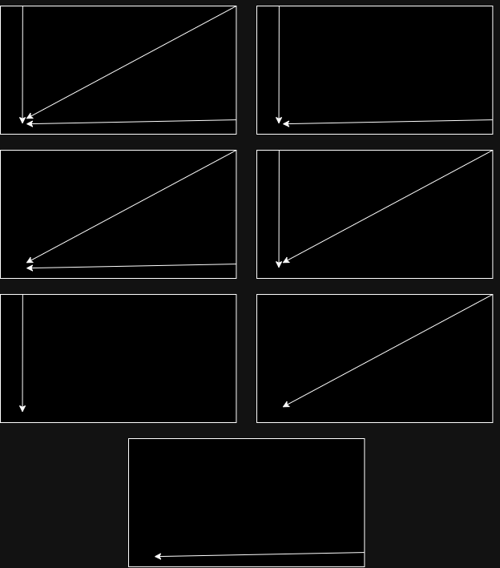

# Proyecto Phaser 3 Balas 

## Objetivo

El objetivo de este proyecto es adaptar un juego existente en Phaser 3, inicialmente diseñado con una sola bala y dos acciones posibles del jugador (saltar o no hacer nada), para que funcione con tres balas (horizontal, vertical y diagonal) y cuatro acciones del jugador (saltar, moverse a la izquierda, moverse a la derecha o quedarse quieto). Además, se busca entrenar un modelo de red neuronal que permita al jugador tomar decisiones automáticas para esquivar las balas de manera efectiva.

## Descripción

El proyecto implica modificar el código del juego en Phaser 3 para incorporar las nuevas funcionalidades. Se realizarán ajustes en la lógica del juego, en el manejo de las balas y en las acciones del jugador. Además, se implementará un modelo de red neuronal utilizando un perceptrón con una arquitectura específica, donde las entradas representan las características de las balas y las salidas corresponden a las acciones del jugador. El modelo será entrenado con datos generados durante el juego para aprender a esquivar las balas de manera óptima.


## Pasos para Realizar el Proyecto

### 1. Modificación del código del juego:
Se ajustará el código del juego en Phaser 3 para adaptarlo a las nuevas características, incluyendo la incorporación de tres balas y la ampliación de las acciones del jugador.

### 2. Diseño del modelo de red neuronal: 
Se definirá la arquitectura del modelo de red neuronal, especificando el número de neuronas en cada capa y la función de activación a utilizar.

### 3. Entrenamiento del modelo de red neuronal:
Se generarán datos de entrenamiento durante la ejecución del juego y se utilizarán para entrenar el modelo de red neuronal.

### 4. Integración del modelo en el juego:
Se implementará la lógica para que el modelo de red neuronal tome decisiones automáticas durante el juego, en función de las características de las balas (en tiempo real).

A continuación se muestra más información del proyecto:

## Modelo de Red Neuronal

Para abordar este problema, se propone el uso de un perceptron.

- La cantidad de neuronas en la capa de entrada corresponde a la cantidad de características de los datos de entrada, que en este caso son seis en total referentes a las tres balas.
- La cantidad de neuronas en la capa de salida coincide con la cantidad de acciones de salida, que son tres: saltar, moverse hacia la izquierda y moverse hacia la derecha.

### Funcion de Activacion

En este caso, se usa la función de activación "sigmoide".


### Bias
El bias puede tomar valores reales, como pueden ser positivos, negativos o cero.

Como no hay un límite específico para el valor máximo que puede tomar el bias. Los valores del bias suelen ser pequeños y se inicializan aleatoriamente para facilitar el entrenamiento de la red neuronal.

En este caso, el bias se incluiría en cada neurona de las capas ocultas y de salida, excepto en la capa de entrada. 

De esta forma, el bias ayudaría a ajustar la salida de cada neurona en función de los datos de entrada y los pesos, lo que permitiría que la red neuronal aprenda a esquivar las balas de manera efectiva.

### Peso Sinaptico 

Los pesos sinápticos son parámetros ajustables que se utilizan para ponderar la influencia de las entradas en las neuronas de la red.

Estos pesos se ajustan (por incremento) durante el entrenamiento de la red neuronal para minimizar el error entre las salidas del modelo y el target (objetivo) esperado.

En un perceptron simple, los pesos sinápticos se conocen como W1 y W2. 

En los pesos sinápticos es donde se almacena el conocimiento de la red neuronal y, si se quiere usar el modelo para futuros problemas similares, se debe guardar el bias, W1 y W2. 

## Tabla - Entradas y Salidas

**Tabla:**

| Dx1 (Distancia Bala 1) | Vx1 (Velocidad Bala 1) | Dx2 (Distancia Bala 2) | Vx2 (Velocidad Bala 2) | Dy (Distancia Bala 3) | Vx3 (Velocidad Bala 3) | S1 (Saltar) | S2 (Moverse Derecha) | S3 (Moverse Izquierda) |
|:-----------------------:|:----------------------:|:----------------------:|:----------------------:|:---------------------:|:----------------------:|:------------:|:----------------------:|:-----------------------:|
|           500           |           100          |           500          |           100          |          450          |            100           |       0      |           0            |            0            |
|           30            |           100          |           500          |           100          |          450          |            100           |       0      |           0            |            0            |
|           500           |           100          |           500          |           100          |           30          |            100           |       0      |           1            |            0            |
|           30            |           100          |           500          |           100          |           30          |            100           |       0      |           1            |            0            |
|           20            |           100          |           20           |           100          |           20          |            100           |       1      |           0            |            1            |


Entradas:
- Distancia de la bala 1
- Velocidad de la bala 1
- Distancia de la bala 2
- Velocidad de la bala 2
- Distancia de la bala 3
- Velocidad de la bala 3
  
Salidas:
- Saltar
- Moverse Izquierda
- Moverse Derecha  


## Target

El target representa la salida deseada o esperada para un conjunto de entradas. Es la respuesta correcta que se quiere que la red neuronal aprenda a predecir. Por lo que su función es usarse como referencia u objetivo durante el proceso de entrenamiento de una red neuronal.

Durante el entrenamiento de la red neuronal, se compara la salida producida contra el target esperado, y se calcula el error. El valor del error se usa para ajustar los pesos sinápticos, con el objetivo de minimizar el error para que cada vez se parezca al resultado esperado.

El target, en este caso, es la combinación de acciones que el jugador debe tomar para esquivar/evitar las tres balas que se dirigen hacia el jugador.
- La primera bala se dirige enfrente del jugador en una línea horizontal con velocidad variable.
- La segunda bala se dirige diagonalmente con velocidad variable.
- La tercera bala cae encima del jugador en el mismo punto con la misma velocidad constante.

### Posibles Situaciones

- Primera situación:
Las tres balas llegan a estar cerca del jugador, en ese caso lo recomendado es mover al jugador a la izquierda (para atrás), y de esa forma esquiva la segunda (diagonal) y tercera bala (cae), y solo tendría que saltar para esquivar la primera bala (horizontal).

- Segunda situación:
La primera bala (horizontal) y la tercera bala (cae) están cerca del jugador, se recomienda mover al jugador para atrás o adelante y saltar.

- Tercera situación:
La primera bala (horizontal) y la segunda bala (diagonal) están cerca del jugador, se recomienda mover al jugador para atrás y saltar.

- Cuarta situación:
La segunda bala (diagonal) y la tercera bala (cae) están cerca del jugador, se recomienda mover al jugador para atrás.

- Quinta situación:
La tercera bala (cae) está cerca del jugador, se recomienda mover al jugador para atrás o adelante.

- Sexta situación:
La segunda bala (diagonal) está cerca del jugador, se recomienda mover al jugador para atrás o adelante.

- Séptima situación:
La primera bala (horizontal) está cerca del jugador, se recomienda saltar.


A continuación se muestra un diagrama que representa las situaciones, ordenadas de la primera a la séptima, de arriba hacia abajo y de izquierda a derecha.



## Código del juego Phaser (3 Balas):
```javascript
var w=800;
var h=400;
var jugador;
var fondo;
var bala, bala2, bala3, balaD=false, balaD3=false, nave;
var salto;
var derechaKey;
var izquierdaKey;
var menu;
var velocidadBala;
var despBala;
var velocidadBala2;
var despBala2;
var velocidadBala3;
var despBala3;
var estatusAire;
var estatuSuelo;
var estatusDerecha;
var estatusIzquierda;
var nnNetwork , nnEntrenamiento, nnSalida, datosEntrenamiento=[];
var modoAuto = false, eCompleto=false;
var cursors;
var juego = new Phaser.Game(w, h, Phaser.CANVAS, '', { preload: preload, create: create, update: update, render:render});

function preload() {
    juego.load.image('fondo', 'assets/game/fondo.jpg');
    juego.load.spritesheet('mono', 'assets/sprites/altair.png',32 ,48);
    juego.load.image('nave', 'assets/game/ufo.png');
    juego.load.image('bala', 'assets/sprites/purple_ball.png');
    juego.load.image('menu', 'assets/game/menu.png');
}

function create() {
    cursors = this.input.keyboard.createCursorKeys();
    juego.physics.startSystem(Phaser.Physics.ARCADE);
    juego.physics.arcade.gravity.y = 800;
    juego.time.desiredFps = 30;
    fondo = juego.add.tileSprite(0, 0, w, h, 'fondo');
    nave = juego.add.sprite(w-100, h-70, 'nave');
    bala = juego.add.sprite(w-100, h, 'bala');
    jugador = juego.add.sprite(50, h, 'mono');
    bala2 = juego.add.sprite(w - 745, -400, 'bala');
    bala3 = juego.add.sprite(w - 30, -400, 'bala');
    juego.physics.enable(jugador);
    jugador.body.collideWorldBounds = true;
    var corre = jugador.animations.add('corre',[8,9,10,11]);
    jugador.animations.play('corre', 10, true);
    juego.physics.enable(bala);
    juego.physics.enable(bala2);
    juego.physics.enable(bala3);
    bala.body.collideWorldBounds = true;
    bala2.body.collideWorldBounds = true; 
    bala2.body.allowGravity = true;
    bala3.body.collideWorldBounds = true; 
    bala3.body.allowGravity = true;
    pausaL = juego.add.text(w - 100, 20, 'Pausa', { font: '20px Arial', fill: '#fff' });
    pausaL.inputEnabled = true;
    pausaL.events.onInputUp.add(pausa, self);
    juego.input.onDown.add(mPausa, self);
    salto = juego.input.keyboard.addKey(Phaser.Keyboard.SPACEBAR);
    derechaKey = juego.input.keyboard.addKey(Phaser.Keyboard.RIGHT);
    izquierdaKey = juego.input.keyboard.addKey(Phaser.Keyboard.LEFT);
    nnNetwork =  new synaptic.Architect.Perceptron(6, 6,6, 4);
    nnEntrenamiento = new synaptic.Trainer(nnNetwork);
}

function enRedNeural(){
    nnEntrenamiento.train(datosEntrenamiento, {rate: 0.0003, iterations: 25000, shuffle: true});
}

function datosDeEntrenamiento(param_entrada){
    nnSalida = nnNetwork.activate(param_entrada);
    var aire=Math.round(nnSalida[0]*100);
    var piso=Math.round(nnSalida[1]*100);
    if(nnSalida[0]>=nnSalida[1]){
        console.log("salte");
    }
    return nnSalida[0] >= nnSalida[1];
}

function datosDeEntrenamientoBala2(param_entrada){
    nnSalida = nnNetwork.activate(param_entrada);
    var der=Math.round(nnSalida[2]*100);
    var izq=Math.round(nnSalida[3]*100);
    if(nnSalida[2]>=nnSalida[3]){
        console.log("Muevo DERECHA");
    }
    return nnSalida[2]>=nnSalida[3];
}

function datosDeEntrenamientoBala3(param_entrada){
    nnSalida = nnNetwork.activate(param_entrada);
    var der2=Math.round(nnSalida[2]*100);
    var izq2=Math.round(nnSalida[3]*100);

    console.log("nnSalida[2]:"+nnSalida[2]);
    console.log("nnSalida[3]:"+nnSalida[3]);
    console.log("Valor Der:"+der2);
    console.log("Valor Izq:"+izq2);

    if (nnSalida[3]>=nnSalida[2]){
        console.log("Muevo IZQUIERDA");
    }

    return nnSalida[3]>=nnSalida[2];
}

function pausa() {
    juego.paused = true;
    menu = juego.add.sprite(w/2, h/2, 'menu');
    menu.anchor.setTo(0.5, 0.5);
}

function mPausa(event){     
    if(juego.paused){ 
        var menu_x1 = w/2 - 270/2, menu_x2 = w/2 + 270/2,
            menu_y1 = h/2 - 180/2, menu_y2 = h/2 + 180/2;
        var mouse_x = event.x , mouse_y = event.y  ;

        if(mouse_x > menu_x1 && mouse_x < menu_x2 && mouse_y > menu_y1 && mouse_y < menu_y2 ){
            if(mouse_x >=menu_x1 && mouse_x <=menu_x2 && mouse_y >=menu_y1 && mouse_y <=menu_y1+90){
                eCompleto=false;
                datosEntrenamiento = [];
                modoAuto = false;
            } else if (mouse_x >=menu_x1 && mouse_x <=menu_x2 && mouse_y >=menu_y1+90 && mouse_y <=menu_y2) {
                if(!eCompleto) {
                    console.log("","Entrenamiento "+ datosEntrenamiento.length +" valores" );
                    enRedNeural();
                    eCompleto=true;
                }
                modoAuto = true;
            }

            menu.destroy();
            resetVariables();
            resetBullet1();
            resetBullet2();
            resetBullet3();
            juego.paused = false;
        }
    }
}

function resetVariables(){
    jugador.body.velocity.x=0;
    jugador.body.velocity.y=0;
    jugador.x = 50;
    jugador.y = h - jugador.height;

    bala2.position.x = w - 745;
    bala2.position.y = -400;
    balaD2 = false;

    bala3.position.x = w - 30;
    bala3.position.y = -400;
    velocidadBala3 = 5;
    bala3.body.velocity.y = velocidadBala3;
    bala3.body.velocity.x = -1 * 750 ;
}

function resetBullet1() {
    bala.body.velocity.x = 0;
    bala.position.x = w - 100;
    balaD = false;
}

function resetBullet3() {
    bala3.body.allowGravity = false; 

    bala3.position.x = w - 30;
    bala3.position.y = -400;
    bala3.body.velocity.x = 0;
    bala3.body.velocity.y = 0;

    var delay2 = Phaser.Timer.SECOND * Phaser.Math.random(4, 6);
    juego.time.events.add(delay2, startBullet3Fall, this);
}

function startBullet3Fall() {
    bala3.body.allowGravity = true;
    velocidadBala3 = 5;
    bala3.body.velocity.y = velocidadBala3; 
    bala3.body.velocity.x = -1 * 750 ;
}

function resetBullet2() {
    bala2.body.allowGravity = false; 
    bala2.position.x = w - 745;
    bala2.position.y = -400;
    var delay = Phaser.Timer.SECOND * Phaser.Math.random(4, 6);
    juego.time.events.add(delay, startBullet2Fall, this);
}

function startBullet2Fall() {
    bala2.body.allowGravity = true;
}

function saltar(){
    jugador.body.velocity.y = -270;
}

function derecha(){
    if(jugador.position.x == 50){
        jugador.position.x += 50; 
        estatusDerecha=1;
        estatusIzquierda=0;
        puedesContar_para_Regresar = false;
    }
}

function izquierda(){
    if(jugador.position.x == 50){
        jugador.position.x -= 50; 
        estatusDerecha=0;
        estatusIzquierda=1;
        puedesContar_para_Regresar = false;
    }
}

        var puedesContar_para_Regresar = true;
        var timer=0;
        var timerDisparo=0;
        function update() {

            estatusDerecha=0;
            estatusIzquierda=0;
            if(puedesContar_para_Regresar==false){
                timer+=1;
            }
            
            if(jugador.position.x == 50){
                if (derechaKey.isDown) {
                    jugador.position.x += 50; 
                    
                    puedesContar_para_Regresar = false;
                    console.log("muevo DER");

                    estatusDerecha=1;
                    estatusIzquierda=0;
                } else if (izquierdaKey.isDown){
                    jugador.position.x -= 50; 
                    
                    puedesContar_para_Regresar = false;
                    console.log("muevo IZQ");
                    estatusDerecha=0;
                    estatusIzquierda=1;
                }
            }
            
            if(timer>25){
                jugador.position.x = Phaser.Math.linear(jugador.position.x, 50, 0.5);
                if(Math.abs(jugador.position.x - 50) < 1){
                    puedesContar_para_Regresar = true;
                    timer=0;
                    jugador.position.x=50;
                }
            }

            fondo.tilePosition.x -= 1;

            juego.physics.arcade.collide(bala, jugador, colisionH, null, this);
            juego.physics.arcade.collide(bala2, jugador, colisionH, null, this);
            juego.physics.arcade.collide(bala3, jugador, colisionH, null, this);

            estatuSuelo = 1;
            estatusAire = 0;

            if(!jugador.body.onFloor()) {
                estatuSuelo = 0;
                estatusAire = 1;
            }

            despBala = Math.floor(jugador.position.x - bala.position.x);

            despBala2 = Math.floor(jugador.position.y - bala2.position.y);

            velocidadBala2=bala2.body.velocity.y;

            velocidadBala3=bala3.body.velocity.y;

            despBala3 = Math.floor(jugador.position.y - bala3.position.y);

            if(modoAuto == false && salto.isDown && jugador.body.onFloor()) {
                saltar();
            }
            
            if(modoAuto == true && bala.position.x > 0 && jugador.body.onFloor()) {
                if (datosDeEntrenamiento([despBala, velocidadBala, despBala2, velocidadBala2, despBala3, velocidadBala3])) {
                    saltar();
                }
            }

            if(modoAuto == true && bala2.position.y > 0) {
                if (datosDeEntrenamientoBala2([despBala, velocidadBala, despBala2, velocidadBala2, despBala3, velocidadBala3])) {
                    derecha();
                }
            }

            if(modoAuto == true && bala3.position.y > 0) {
                if (datosDeEntrenamientoBala3([despBala, velocidadBala, despBala2, velocidadBala2, despBala3, velocidadBala3])) {
                    izquierda();
                }
            }

            if(balaD == false) {
                disparo();
            }
            else if (bala.position.x <= 0) {
                resetBullet1();
            }

            if(balaD3 == false) {
                disparo3();
            }
            else if (bala3.position.y > 340) {
                resetBullet3();
            }

            if (bala2.position.y > 350) {
                resetBullet2();
            }

            if(modoAuto == false && bala.position.x > 0) {
                datosEntrenamiento.push({ 
                    'input' :  [despBala, velocidadBala, despBala2, velocidadBala2, despBala3, velocidadBala3], 
                    'output':  [estatusAire, estatuSuelo, estatusDerecha, estatusIzquierda]  
                });
            }
        }    

        function disparo(){
            velocidadBala =  -1 * velocidadRandom(100,200); 
            bala.body.velocity.y = 0 ;
            bala.body.velocity.x = velocidadBala ;
            balaD=true;
        }

        function disparo3(){
            velocidadBala3 = 5;
            bala3.body.velocity.y = velocidadBala3;
            bala3.body.velocity.x = -1 * 750 ; 
            balaD3=true;
        }

        function colisionH(){
            resetVariables();
            pausa();            
        }

        function velocidadRandom(min, max) {
            return Math.floor(Math.random() * (max - min + 1)) + min;
        }

        function render(){

        }

```

## Resultados

El código del juego en Phaser 3 se adaptó para funcionar con tres balas y cuatro acciones del jugador. Se implementó un modelo de red neuronal utilizando un perceptrón para la toma automática de decisiones del jugador.

