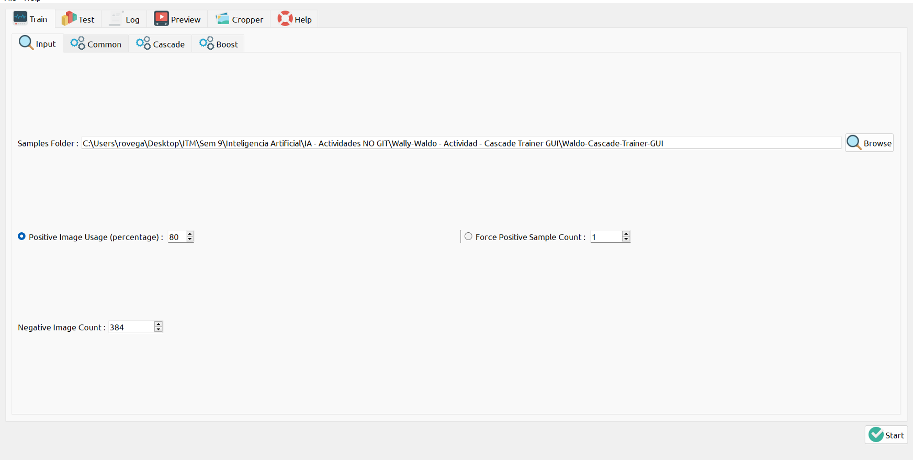
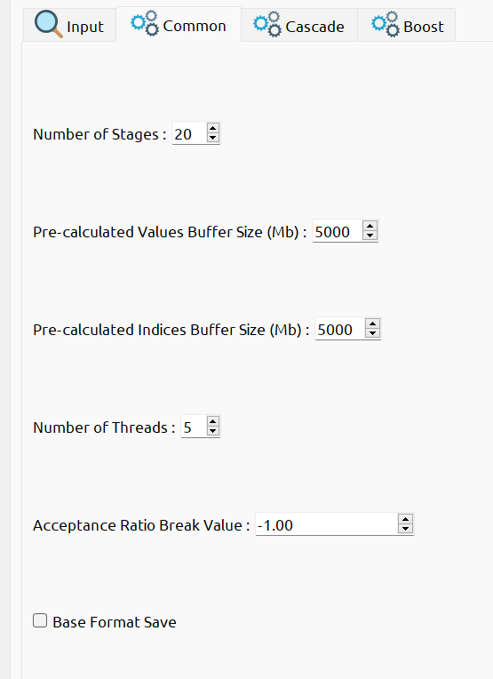
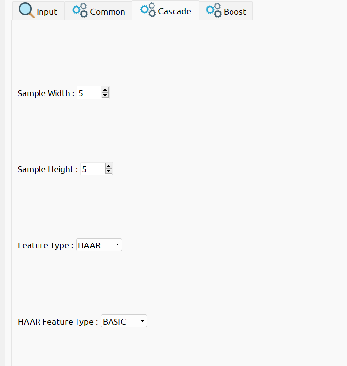
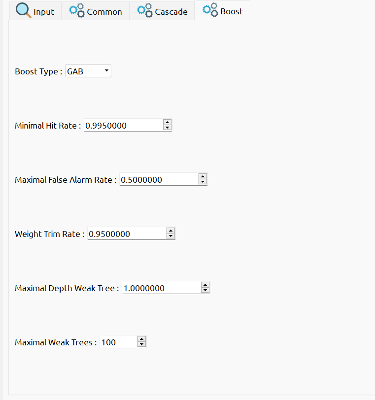
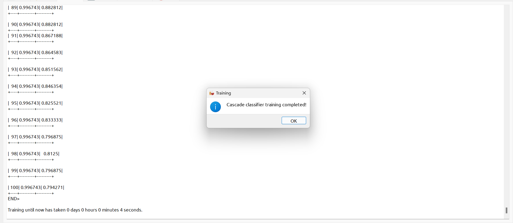

# Actividad Wally/Waldo - Haarcascade


## Recortando Imágenes - Resize 

Se usó la herramienta "ImageMagick" y código de Python para cambiar el tamaño de las imágenes encontradas en Google y en repositorios de GitHub donde Wally se encontraba y en donde no se encontraba. 

Las imágenes donde está Wally son las positivas (p) y donde no se encuentra Wally son las negativas (n). 

### ImageMagick

Usando PowerShell se posiciona en la ubicación de la carpeta con las imágenes y después se usa el comando para renombrar y modificar el tamaño de las imágenes. 

Comandos:
```powershell

cd "C:\Users\rovega\Desktop\ITM\Sem 9\Inteligencia Artificial\IA - Actividades NO GIT\Wally-Waldo - Actividad - Cascade Trainer GUI\Waldos Fotos\WALDO-50"

magick mogrify -resize 50x50! *.jpg


```


### Python - Código

El código del archivo "Ej7.5-ImgReescalar.ipynb" código también cambia el tamaño de las imágenes a 50x50 píxeles. 

Código:
```python

import cv2 as cv
import numpy as np
import os

def escala(imx, escala):
    #width = int (imx.shape[1] * escala / 100) #escalo el porcentaje de ancho
    #height = int (imx.shape[0] * escala / 100) #escalo el porcentaje de alto
    #size= (width, height) #
    #im = cv.resize (imx, size, interpolation = cv.INTER_AREA) #resize (img, nuevo tamaño, tipo de interpolacion) 
    
    size = (escala, escala)
    im = cv.resize(imx, size, interpolation=cv.INTER_AREA)
    return im
    # - resize: escalar positivamente o negativamente
    # - interpocation: rellenar espacios de img.
    # - cv.INTER_AREA: dice como llenar huecos de img
    

# Carpeta de entrada y salida
folder_input = r'C:\Users\rovega\Desktop\ITM\Sem 9\Inteligencia Artificial\IA - Actividades NO GIT\Wally-Waldo - Actividad - Cascade Trainer GUI\Waldos Fotos\WALDO'
folder_output = r'C:\Users\rovega\Desktop\ITM\Sem 9\Inteligencia Artificial\IA - Actividades NO GIT\Wally-Waldo - Actividad - Cascade Trainer GUI\Waldos Fotos\WALDO-50'

# Asegúrate de que la carpeta de salida exista
if not os.path.exists(folder_output):
    os.makedirs(folder_output)
    
    
# Iterar sobre cada archivo en la carpeta de entrada
for x in os.listdir(folder_input):

     # Construir la ruta completa para la imagen de entrada
    input_path = os.path.join(folder_input, x)
    
    # Leer la imagen
    img = cv.imread(input_path)
    
    # Aplicar la función de escala
    img_rescaled = escala(img, 50)  # Escalar a los pixeles que se quiera, en esta caso 50x50
    
    
    
    # Construir la ruta completa para la imagen de salida
    output_path = os.path.join(folder_output, x)
    
    # Guardar la imagen escalada en la carpeta de salida
    cv.imwrite(output_path, img_rescaled)


```

## Cascade Trainer GUI - Generación de Modelo

Para poder usar esta [herramienta](https://amin-ahmadi.com/cascade-trainer-gui/) lo primero que se hizo fue tener una carpeta, donde se encuentren las imágenes positivas e imágenes negativas. 

- Positivas: Las imágenes que incluyen el objeto que se busca.
- Negativas: Las imágenes que no deben incluir el objeto que se busca. 

Ambos tipos de imágenes se consideran en un tamaño de 50x50 píxeles. 

Se consideraron los siguientes puntos para generar el modelo:

- Que todas las imágenes fueran del mismo tamaño, para que el programa funcione adecuadamente.
- Las imágenes con el objeto a buscar pueden estar rotadas.
- Al momento de modificar la imagen como por medio de rotación o iluminación ya se considera como otra imagen.
- La cantidad de imágenes positivas de Wally deben ser del mismo objeto (no importa si tiene objetos alrededor).
- La cantidad de imágenes negativas realmente no importa lo que es o su contenido, solo deben tener el entorno/contexto donde podría estar el objeto. 
- Se debe tener la misma cantidad de positivas y negativas, para que no se incline o asuma más, por un lado, que el otro, que no crea que hay más donde no está Wally.
- Se puede ir cambiando la cantidad de imágenes para tener mejores resultados. Cómo disminuir la cantidad si no funciona el modelo.
- Se puede ir cambiando con la tonalidad de colores, se puede usar escala de grises.

El objetivo es generar un archivo XML con clasificadores de Haar que se use como cascada de Haar para buscar objetos en una imagen.

Se quiere hacer una generalización de qué es el mismo objeto en diferentes ambientes.

El tamaño del XML puede variar dependiendo de la cantidad de imágenes que se usen:
- Menos de 1 kilobyte: El XML no se generó correctamente.
- Alrededor de 280 kilobytes.
- 1 megabyte.
  
### Pasos

#### Paso 1
Crear una carpeta para el objeto (Wally), dentro de la cual se deben tener dos subcarpetas, una llamada "p" para las imágenes positivas y otra llamada "n" para las imágenes negativas.

Las muestras de imágenes positivas son las imágenes del objeto que se desea entrenar en el clasificador y detectar. Por ejemplo, si se quiere entrenar y detectar coches, entonces se necesitan muchas imágenes de coches. También se deben contar con muchas imágenes negativas. Las imágenes negativas pueden ser cualquier cosa excepto coches.

**Nota importante 1:** Las imágenes negativas NUNCA deben incluir ninguna imagen positiva. Ni siquiera parcialmente.

**Nota importante 2:** En teoría, las imágenes negativas pueden ser cualquier imagen que no sea la imagen positiva, pero en la práctica, las imágenes negativas deben ser relevantes para las imágenes positivas. Por ejemplo, usar imágenes del cielo como imágenes negativas es una elección deficiente para entrenar un buen clasificador de coches, aunque no tenga un efecto negativo en la precisión general.


#### Paso 2 - Menú "Input"

Abrir "Cascade Trainer GUI" en el menú de "Input" en la opción "Samples Folder" se debe seleccionar la carpeta o escribir la ruta de la carpeta con las imágenes "p" y "n" del objeto.

En el apartado "Positive Image Usage (percentage)" se recomienda usar 80 o 90, ya que al dejar 100 a veces se generan errores como el siguiente `"OpenCV Error: Bad argument (Can not get new positive sample. The most possible reason is insufficient count of samples in given vec-file.
) in CvCascadeImageReader::PosReader::get, file D:\cv\opencv_3.2.0\sources_withTextModule\apps\traincascade\imagestorage.cpp, line 158"`

En el apartado "Negative Image Count" se escribe la cantidad de imágenes negativas que se tienen, en este caso 384. 

Y en el apartado "Force Positive Sample Count" se deja por defecto.

Se puede configurar el tamaño del búfer de precalculo para ayudar con la velocidad del proceso de entrenamiento. Se puede asignar tanta memoria como sea posible para estos, pero hay que tener cuidado de no asignar demasiado o muy poco. Por ejemplo, si se tiene 8 GB de RAM en la computadora, entonces se puede configurar de manera segura ambos tamaños de búfer a 2048.



#### Paso 3 - Menú "Common"

Se dejaron las opciones por defecto, solo se cambiaron las siguientes opciones:
- Pre-calculated Values Buffer Size (Mb): 5000
- Pre-calculated Indices Buffer Size (Mb): 5000



#### Paso 4 - Menú "Cascade"

Las imágenes tienen dimensiones de 50x50 píxeles, por lo tanto, se utilizaría 5x5 en los campos de "sample width" y "sample height". Las demas opciones se dejaron como vienen por defecto.

Por ejemplo, si las imágenes de muestra tienen dimensiones de 320×240 píxeles, primero se calcula la relación de aspecto, que en este caso es de 1.33:1. Luego, se multiplica el número más grande por 24. Esto resultaría en 32×24 para el ancho y alto de la muestra.



#### Paso 5 - Menú "Boost"

Se dejaron las opciones por defecto.



#### Paso 6 - Entrenar/Start Training"

Si todo sale bien, y uno espera a que el entrenamiento se complete, debería aparecer el mensaje "Cascade classifier training completed!", sin ningún error en la ventana. 

En la carpeta del clasificador, se puede dar uno cuenta que se han creado nuevos archivos y carpetas en esta ubicación.

- Las carpetas "n" y "p" son familiares, pero el resto son nuevos. 
- La carpeta "classifier" contiene archivos XML que se generan durante diferentes etapas del entrenamiento. 

Dentro de la carpeta "classifier", se nota algo similar a lo siguiente:

- Los archivos "stage#.xml" son archivos temporales que ya no serán necesarios.

- "params.xml" contiene los parámetros utilizados para el entrenamiento.

- "cascade.xml" es el clasificador de cascade el cual debería encontrarse si el entrenamiento se completó con éxito.

- Los archivos "neg.lst", "pos.lst" y "pos_samples.vec" son archivos temporales creados para el entrenamiento del clasificador y pueden eliminarse sin tener ningún efecto.

En este caso, el modelo XML de Wally pesa 269 KB.



## Código Detección de Wally - Leer Modelo 

- Primero se utiliza el modelo XML del clasificador de cascada de Haar previamente entrenado para detectar la presencia de Wally en una imagen. 
- Luego, se lee la imagen que se desea usar para detectar a Wally. 
- Después, la imagen se convierte a escala de grises para facilitar el procesamiento. 
- Se utiliza el método `detectMultiScale` para encontrar posibles apariciones de Wally en la imagen, utilizando parámetros como el factor de escala, el número mínimo de vecinos y el tamaño mínimo de la ventana de búsqueda. 
- Con un condicional "if" si no se encontró a Wally, se imprime un mensaje. En caso contrario, se dibuja un rectángulo alrededor de cada aparición detectada de Wally en la imagen.
- Se guarda la imagen con los rectángulos dibujados en la ruta proporcionada.
- Por último, se muestra un mensaje indicando que se detectó a Wally y se proporciona la ruta donde se guardó la imagen resultante.

Código:
```python
import cv2 as cv
import os

#Usar modelo XML 
wally_cascade = cv.CascadeClassifier(r'C:\Users\rovega\Desktop\ITM\Sem 9\Inteligencia Artificial\IA - Actividades NO GIT\Wally-Waldo - Actividad - Cascade Trainer GUI\Waldo-Cascade-Trainer-GUI\classifier\cascade.xml')

# Leer img 
image_path = r'C:\Users\rovega\Desktop\ITM\Sem 9\Inteligencia Artificial\IA - Actividades NO GIT\Wally-Waldo - Actividad - Cascade Trainer GUI\Waldos Fotos\Test IA\test2.jpg'
image = cv.imread(image_path)

# Convertir img a escala de grises
gray = cv.cvtColor(image, cv.COLOR_BGR2GRAY)

# Detectar a Wally en la img
wally_apparitions = wally_cascade.detectMultiScale(gray, scaleFactor=1.01, minNeighbors=30, minSize=(10, 10))


if len(wally_apparitions) == 0:
    print("Wally no se encontro.")
else:
    #Dibujar rectangulo de Wally
    for (x, y, w, h) in wally_apparitions:
        cv.rectangle(image, (x, y), (x + w, y + h), (0, 255, 0), 2)

    #Guardar img con rectangulos
    output_path = r'C:\Users\rovega\Desktop\ITM\Sem 9\Inteligencia Artificial\IA - Actividades NO GIT\Wally-Waldo - Actividad - Cascade Trainer GUI\Waldos Fotos\Test IA\Resultados\wallydetectado.jpg'
    cv.imwrite(output_path, image)

    print(f"Wally detectado. Path: {output_path}.")


```
